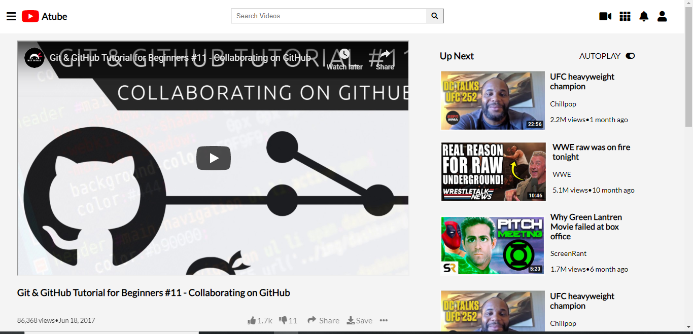

</h1># EMBEDDING-IMAGES-AND-VIDEO</h1>

This project is a clone of youtube interface. The aim of this project was to recreate youtube desing using html and css technologies.

</h1>Additional description about the project and its features.</h1>

Built With
Html
CSS
Atom editor

<h2>Live Demo</h2>
https://atube.netlify.app/

<h2>Getting Started</h2>
To get a local copy up and running follow these simple example steps.

Prerequisites
Text editor,Github profile and Git.

<h2>Authors</h2>

👤 Author1

Github: @ajkacca457
Twitter: @ajkacca
Linkedin: https://www.linkedin.com/in/avijit-karmaker-8738a54a/

👤 Author2

Github: @Abhigyan001
Linkedin: https://www.linkedin.com/in/abhigyan-mahanta-b49799145/

🤝 Contributing
Contributions, issues and feature requests are welcome!

Feel free to check the issues page.

Show your support
Give a ⭐️ if you like this project!

📝 <h2>License</h2>
This project is a collaboration project of microverse students. All rights are reserved for Avijit and Abhigyan.
